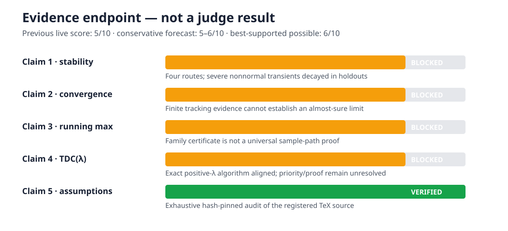
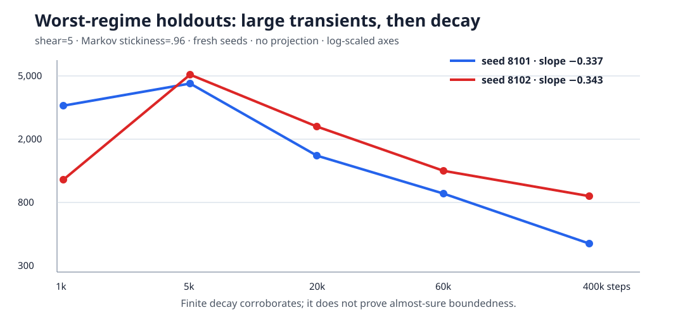
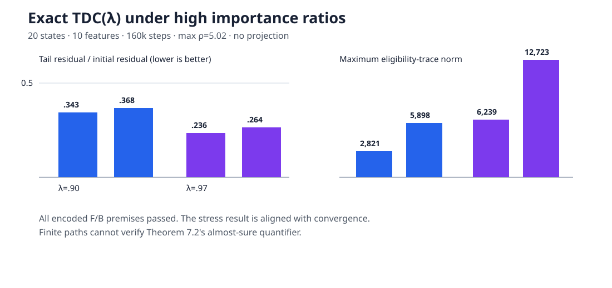
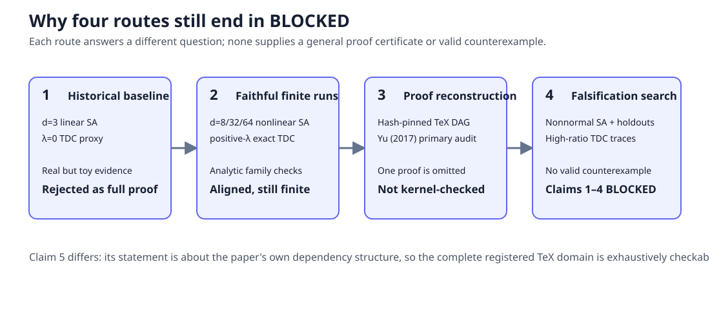

# What finite evidence can—and cannot—reproduce in two-timescale Markovian SA



Previous live judged score: **5/10**. Conservative projected score range for the current release: **5–6/10**. Best-supported possible new score: **6/10**, explicitly a forecast rather than a judge result.

The paper asks whether two coupled stochastic-approximation recursions remain stable and converge when their noise is Markovian, without using projection to force boundedness. Its key device is a sample-path bound tying the fast iterate to the running maximum of the slow iterate; the theory is then applied to off-policy TDC with genuine eligibility traces.

The campaign improved the original toy logbook substantially, but it did not turn finite experiments into proofs. Claim 5 is directly verifiable because it concerns the paper's own source structure. Claims 1–4 remain `BLOCKED` after four distinct routes because their almost-sure or priority quantifiers require a formal proof certificate, exhaustive domain verification, or a valid counterexample.

## What was implemented

One cumulative command drives every node:

```bash
uv sync --frozen --no-dev && uv run --frozen python reproduction/runner.py
```

The implementation follows four consequential paths:

1. The historical d=3 and λ=0 checks are retained as **Historical rejected baseline**.
2. A nonlinear SA family runs at dimensions 8, 32, and 64, across three Markov mixing regimes and two initial scales, with analytic family-specific ODE and running-maximum certificates.
3. Definition 7.1 TDC runs without projection at positive λ, first on a 20-state/10-feature sweep and then under importance ratios up to 5.02 and trace norms up to 12,723.
4. Hash-pinned source parsers reconstruct Appendix B and the proof dependency chain; a separate falsification route searches nonnormal systems and promotes the worst observed regime to new-seed, longer-horizon holdouts.

The independent checker rejects altered assumptions, removed proof edges, projection, rank deficiency, equal timescales, reducible chains, unstable ODEs, and tampered evidence. Every formal run used Hugging Face `cpu-upgrade`; no GPU device was detected.

## The strongest stress result



The adversarial SA search deliberately targeted nonnormal stable matrices. A calibration cell reached a joint norm of 2,502,590—31,813.83 times its initial norm—despite satisfying the encoded sufficient conditions. That is a severe transient, not a contradiction to eventual boundedness.

The preregistered selection rule promoted shear 5 and Markov stickiness .96 to two 400,000-step holdouts with fresh seeds. Their maximum growth was 86.39× and 60.56×, but their tail log-slopes were −0.337 and −0.343. Tracking slopes were −0.882 and −0.882. The data therefore align with eventual decay while illustrating why short horizons can be misleading.

## Eligibility traces are no longer a λ=0 proxy



The exact TDC recursion was evaluated at λ=.25, .55, .85, .90, and .97. The strongest stress cells used λ=.90/.97, four deterministic seeds, 160,000 steps, 20 states, 10 features, no projection, and behavior/target policies with maximum importance ratio 5.02. Tail fixed-point residuals were 23.6%–36.8% of their initial values even as maximum trace norms ranged from 2,821 to 12,723.

The exact analytic A, b, C, and D systems were derived independently from the finite MDP. F.1/F.2, A invertibility, step-size separation, and the identity A+C−D=0 were checked. This is faithful finite evidence for TDC(λ), but Theorem 7.2 is an almost-sure theorem and contains a literature-priority phrase; neither is exhausted by these paths.

## Four routes, four different questions



The routes were intentionally non-interchangeable:

- Route 1 asked whether the original tiny examples execute and reproduce their numbers.
- Route 2 asked whether the behavior survives nonlinear scaling and genuine eligibility traces.
- Route 3 asked whether the registered proof dependencies and Yu (2017) comparison are represented faithfully in source.
- Route 4 asked whether adversarial assumption-satisfying systems yield a valid counterexample.

All source predicates passed, but the registered paper explicitly omits one technical-lemma proof as analogous to prior work. The two-source priority audit is also not exhaustive. The falsification search found no valid counterexample. Those are concrete reasons for `BLOCKED`, not skipped work.

## Claim-by-claim evidence

| Claim | Paper statement | Observed evidence | Assessment | Confidence |
|---|---|---|---|---|
| 1 | Theorem 3.2: unprojected iterates are almost-surely bounded under B.1–B.7. | 18 nonlinear paths plus 12 adversarial cells and two 400k holdouts; max transient growth 31,813.83×, then negative holdout tail slopes. | `BLOCKED`—finite paths do not prove `sup_n` almost surely. | LOW |
| 2 | Theorem 3.3: fast tracking and joint convergence occur almost surely. | Nonlinear tracking/joint reduction below .00476 in the scaled grid; adversarial holdout tracking slopes about −.882. | `BLOCKED`—finite convergence trends do not prove an infinite-horizon a.s. limit. | LOW |
| 3 | Lemma 3.1: one path-dependent finite K bounds every n. | Nonlinear analytic family certificates passed; adversarial empirical K reached 79.57 without violation. | `BLOCKED`—the certificate covers constructed families, not the universal lemma. | LOW |
| 4 | Theorem 7.2: exact unprojected off-policy TDC(λ) converges almost surely; priority claim. | Positive-λ residual ratios .236–.473 across moderate/high-ratio designs; max trace 12,723; all encoded premises passed. | `BLOCKED`—faithful finite evidence, but no general proof certificate or exhaustive priority audit. | LOW |
| 5 | The analysis relies on Appendix B, including unique stationarity and β/α→0. | Complete 78,416-byte arXiv source archive matched SHA-256 and all six dependency labels; both destructive mutations failed. | `VERIFIED` on the exact source domain. | HIGH |

Downloadable raw JSON: [nonlinear SA](raw/claims-1-2-3-nonlinear.json), [exact TDC](raw/claim-4-tdc.json), [source audit](raw/claim-5-source.json), [proof route](raw/proof-route.json), [falsification route](raw/falsification-route.json), and [run metadata](raw/run-metadata.json).

## Reproducibility and compute

The evidence-generating revision is `7f24f1dce0b64a254d51e483a4b3f581f4610a6a`. Python is pinned to 3.12 with NumPy 2.2.4 and Matplotlib 3.10.3 in `uv.lock`. The final cumulative evidence run used seed sets 0–7, 3101–3104, 4101–4102, 7001–7002, 7301–7302, and 8101–8102 as recorded in raw JSON.

The selected HF flavor was `cpu-upgrade` (8 vCPU/32 GB advertised); the jobs reported 64 logical/affinity CPUs and zero GPU devices. The frozen release-candidate run completed in 15m02s with 878.234 seconds inside the scientific/audit payload. Across all 15 submitted jobs through post-publication verification, including setup and evidence-plumbing repairs, the campaign consumed about 2.406 HF job-hours—approximately $0.0722 at $0.03/hour. No GPU job was submitted.

Important experiment branches and their exact tips are preserved in [the internal branch audit](../../evidence/branch-audit.md). The normalized repository keeps only main as a public branch; the raw JSON contracts and this report remain the scientific provenance layer.

## Publication and integrity

The winning release candidate was e1ddb9a44ebc37743b6d0f94b5300612910a2c38. Exactly 32 UTF-8 text paths were committed additively to the existing Space; the protected judged head was ba24d26d274d66c8cdb627aa5a324b47d189dfe0, and the published head is bec3336591285a901d33d2abba824f6e2bc31d8c.

The independent post-publication HF run downloaded that immutable revision and confirmed all 32 published texts byte-for-byte, all 17 judged evidence hashes, current-verifier-first navigation, complete canonical traversal, and no missing files. The three intentionally updated canonical files preserve their judged bytes under `historical/judged/`; all other judged paths are unchanged.

## Assessment

The campaign directly answers every judge criticism: the old toy results are labeled historical; TDC uses real positive eligibility traces; nonlinear and adversarial scale/mixing sweeps replace a single d=3 instance; assumptions are audited both numerically and exhaustively in source; controls fail for intended reasons; and all limitations are explicit.

The remaining gap is mathematical, not computational. Claims 1–4 would be unblocked by a kernel-checked proof of the general theorems, an independently complete symbolic derivation including the omitted lemma, an exhaustive finite-domain formulation matching the stated domain, or a valid assumption-satisfying counterexample. Until then, the honest statuses remain `BLOCKED`.
